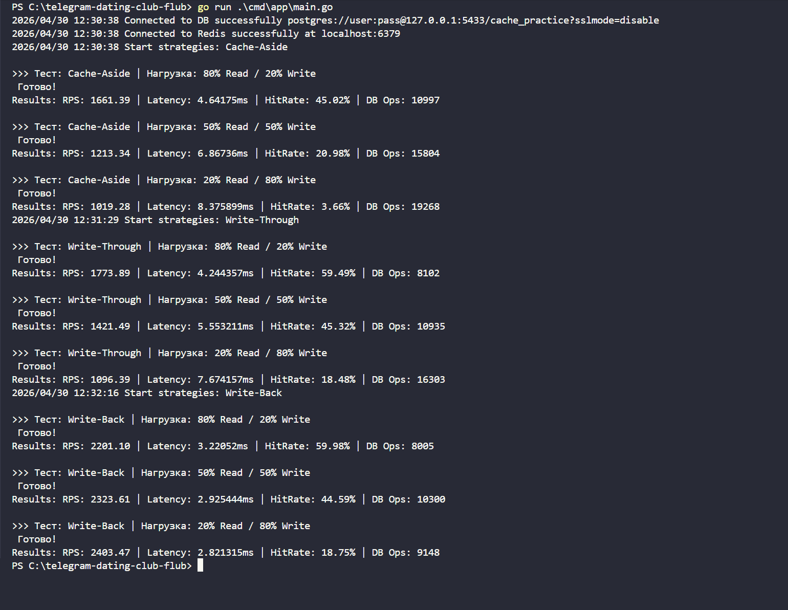

# Результаты сравнения стратегий кэширования

## Таблица результатов

| Стратегия     | Нагрузка            | RPS     | Latency (ms) | HitRate% | DB Ops (Total) |
| ------------- | ------------------- | ------- | ------------ | -------- | -------------- |
| **Lazy**      | read-heavy (80/20)  | 1 661   | 4.64         | 45.0%    | 10 997         |
| **Lazy**      | balanced (50/50)    | 1 213   | 6.86         | 20.9%    | 15 804         |
| **Lazy**      | write-heavy (20/80) | 1 019   | 8.37         | 3.6%     | 19 268         |
| **Write-Through** | read-heavy (80/20) | 1 773   | 4.24         | 59.4%    | 8 102          |
| **Write-Through** | balanced (50/50)    | 1 421   | 5.55         | 45.3%    | 10 935         |
| **Write-Through** | write-heavy (20/80) | 1 096   | 7.67         | 18.4%    | 16 303         |
| **Write-Back** | read-heavy (80/20)  | 2 201   | 3.22         | 59.9%    | 8 005          |
| **Write-Back** | balanced (50/50)    | 2 323   | 2.92         | 44.5%    | 10 300         |
| **Write-Back** | write-heavy (20/80) | 2 403   | 2.82         | 18.7%    | 9 148          |

---

---

## Анализ по стратегиям

### 1. Lazy Loading (Cache-Aside)
Показала самые слабые результаты при интенсивной записи.
*   **Проблема:** Каждая запись инвалидирует (удаляет) ключ. При 80% записей Hit Rate падает почти до нуля (**3.6%**), превращая кэш в бесполезную прослойку, которая только увеличивает задержку.
*   **Вердикт:** Худший выбор для динамических данных с частыми обновлениями.

### 2. Write-Through
Заметно стабильнее предыдущей стратегии за счет того, что данные попадают в кэш одновременно с записью в БД.
*   **Преимущество:** Даже при высокой нагрузке на запись Hit Rate держится на уровне **18.4%**, что в 5 раз лучше, чем у Lazy.
*   **Производительность:** RPS выше на 10-15%, так как чтение чаще завершается в Redis.

### 3. Write-Back
Абсолютный лидер в данных тестах.
*   **Парадокс скорости:** Это единственная стратегия, где производительность **растет** вместе с интенсивностью записи (RPS увеличился с 2201 до 2403).
*   **Эффективность:** Задержка в 2.8 мс — лучшая среди всех тестов. Количество операций с БД при записи сократилось в **2.1 раза** по сравнению с Lazy (9 148 против 19 268) благодаря отложенной записи и батчингу.

---

## Общий вывод
Для сценариев с высокой интенсивностью записи (например, частое обновление профилей или статусов) **Write-Back** дает колоссальное преимущество по RPS и разгрузке базы данных. Однако, при использовании этой стратегии необходимо учитывать риск потери данных, находящихся в памяти в момент возможного сбоя.