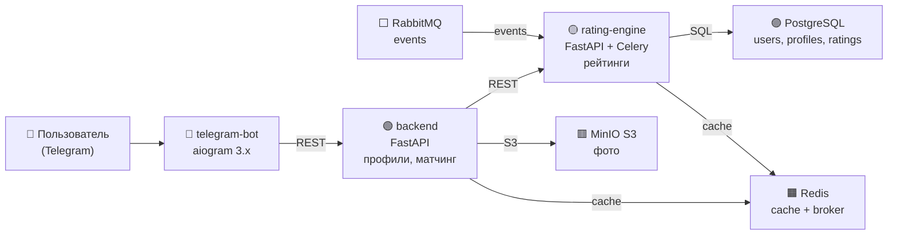

## Этап 1: Планирование и проектирование

### 1. Описание сервисов

Проект реализован в виде микросервисной архитектуры с минимальным количеством сервисов (4 микросервиса + инфраструктура), чтобы сохранить преимущества независимого масштабирования и при этом не усложнять разработку.

| Сервис            |  Технологии               | Основная функция                                     |
|-------------------|---------------------------|----------------------------------------------------------------|
| telegram-bot      | Python + aiogram 3.x      | Интерфейс пользователя, состояния (FSM), клавиатуры, обработка сообщений |
| backend           | FastAPI                   | Пользователи, профили, CRUD анкет, загрузка фото, базовый матчинг |
| rating-engine     | FastAPI + Celery          | Расчёт первичного, поведенческого и комбинированного рейтинга, периодические задачи |
| storage           | MinIO (S3-совместимый)    | Хранение и раздача фотографий пользователей                    |

**Инфраструктурные компоненты:**
- PostgreSQL — основное хранилище данных
- Redis — кэш предзагруженных анкет + брокер Celery
- RabbitMQ — асинхронная передача событий (лайк, пасс, матч → пересчёт рейтинга)
- Celery Beat — периодический пересчёт рейтингов

### 2. Архитектура системы и схема дизайна

