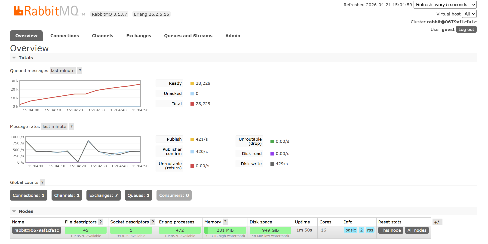

# СРАВНИТЕЛЬНЫЙ АНАЛИЗ ПРОИЗВОДИТЕЛЬНОСТИ RABBITMQ И REDIS

## 1. ОПИСАНИЕ ЭКСПЕРИМЕНТА

**Цель:** Сравнить пропускную способность и задержки (latency) брокеров сообщений в одинаковых условиях.

**Стенд тестирования:**

- Язык: Python 3.14, асинхронный стек (`asyncio`)
- Клиенты: `aio-pika` (RabbitMQ), `redis[asyncio]` + Redis Streams (Redis)
- Окружение: Docker-контейнеры (Windows, Docker Desktop)

**Аппаратные лимиты (Docker Compose):**

| Параметр | Значение |
|----------|----------|
| CPUs     | 1.0      |
| Memory   | 512 MB   |

**Параметры тестов:**

- Длительность каждого прогона: **30 секунд**
- Размеры сообщений: `128 B`, `1 KB`, `10 KB`, `100 KB`
- Целевые интенсивности: `1 000`, `5 000`, `10 000` msg/sec
- Формат сообщений: JSON-конверт с полем `t` (timestamp для latency) и `d` (payload)

---

## 2. СВОДНАЯ ТАБЛИЦА РЕЗУЛЬТАТОВ

### RabbitMQ

### Базовое сравнение (1 KB, цель 1 000 msg/sec)

| Метрика             | RabbitMQ  | Redis      |
|---------------------|-----------|------------|
| Фактический send/s  | 54        | **644**    |
| Отправлено (30 сек) | 1 625     | **19 449** |
| Получено            | 1 625     | **19 449** |
| Потеряно            | 0         | 0          |
| Avg latency, ms     | 18.99     | **3.15**   |
| P95 latency, ms     | 46.14     | **5.28**   |
| Max latency, ms     | 57.46     | **13.94**  |
| Деградация          | —         | —          |

### Влияние размера сообщения (цель 1 000 msg/sec, 30 сек)

| Размер  | RabbitMQ send/s | Redis send/s | RabbitMQ P95, ms | Redis P95, ms |
|---------|-----------------|--------------|------------------|---------------|
| 128 B   | 42              | **616**      | 46.32            | **5.39**      |
| 1 KB    | 54              | **610**      | 46.41            | **5.51**      |
| 10 KB   | 21              | **587**      | 50.33            | **5.81**      |
| 100 KB  | 85              | **155**      | 50.95            | **45.47**     |

### Влияние интенсивности потока (1 KB, 30 сек)

| Цель msg/sec | RabbitMQ send/s | Redis send/s | RabbitMQ P95, ms | Redis P95, ms |
|--------------|-----------------|--------------|------------------|---------------|
| 1 000        | 54              | **637**      | 46.05            | **5.33**      |
| 5 000        | 51              | **603**      | 46.36            | **5.52**      |
| 10 000       | 49              | **614**      | 46.58            | **5.45**      |

---

## 3. ПОДРОБНЫЙ АНАЛИЗ

### Сценарий 1: Базовая пропускная способность

Самый показательный результат всего бенчмарка. При одинаковой нагрузке Redis обработал в **~12 раз** больше сообщений, чем RabbitMQ (19 449 против 1 625 за те же 30 секунд).

Причина — архитектурная: операция `XADD` в Redis выполняется за **~1–2 мс** (простая запись в in-memory структуру данных), тогда как `basic_publish` в RabbitMQ проходит через полный стек AMQP 0-9-1: фрейминг, маршрутизация через exchange, запись в durable-очередь, подтверждение брокера. При использовании async single-channel клиента каждое сообщение ожидает round-trip к брокеру, что даёт ~18 мс на операцию против ~3 мс у Redis.

### Сценарий 2: Влияние размера сообщения

Redis практически не реагирует на увеличение размера до 10 KB: пропускная способность снизилась лишь с 616 до 587 msg/s, а P95 latency выросла незначительно — с 5.39 до 5.81 мс. Redis хранит и читает данные из RAM без сериализации, поэтому размер payload при небольших значениях почти не влияет на задержку.

На **100 KB** Redis заметно просел: 155 msg/s вместо 610, а P95 выросла с 5.51 до 45.47 мс. Это точка начала деградации для Redis: передача и копирование крупных объектов в памяти создаёт давление на memory allocator.

RabbitMQ проявляет интересное поведение: на 10 KB резкое падение до 21 msg/s, но на 100 KB — неожиданный рост до 85 msg/s. На 100 KB одно сообщение несёт больше данных за тот же AMQP-round-trip, поэтому эффективная пропускная способность в байтах/сек растёт. Задержка P95 при этом практически не меняется (~50 мс), что говорит о стабильности AMQP-стека при любом размере payload.

### Сценарий 3: Влияние интенсивности потока

Ключевой вывод: **ни один из брокеров не масштабировался по целевым RPS** — ни на 1 000, ни на 5 000, ни на 10 000 msg/sec. RabbitMQ устойчиво выдаёт ~50 msg/s, Redis — ~610 msg/s при любом заданном темпе. Это означает, что оба брокера уже работают на пределе своей пропускной способности в рамках одного async-producer: брокер, а не rate-limiter, является узким местом.

Ни один из брокеров не показал деградации (флаг `False`), потому что consumer успевал вычитывать весь поток — очереди не накапливались.

---

## 4. АНАЛИЗ ДЕГРАДАЦИИ (SINGLE INSTANCE)

### Redis

- Начало деградации заметно при переходе от **10 KB → 100 KB**: send/s падает с 587 до 155, P95 вырастает с 5.81 до 45.47 мс
- Точка деградации по latency: **100 KB+ payload** при текущем ресурсном лимите (512 MB)
- При заполнении памяти Redis выдаёт `OutOfMemoryError` и отказывается принимать новые записи — жёсткий, неграциозный отказ

### RabbitMQ

- Деградация не зафиксирована ни на одном из тестовых уровней нагрузки
- Пропускная способность стабильна и почти не зависит ни от размера payload, ни от целевого RPS: ~50–85 msg/s на всех прогонах
- Задержка P95 стабильна (~46–51 мс) при любом размере сообщения — RabbitMQ предсказуемо медленный, но предсказуемо стабильный
- Узкое место — сам AMQP-протокол (round-trip + фрейминг), а не пропускная способность очереди

---

## 5. ВЫВОДЫ

### Какой брокер показал большую пропускную способность?

**Redis** — в **~12 раз** выше, чем RabbitMQ при работе с сообщениями до 10 KB. На 100 KB разрыв сокращается до ~2x, но Redis всё равно быстрее.

### Какой брокер лучше переносит увеличение размера сообщения?

**RabbitMQ** — его P95 latency практически не меняется с ростом payload (46–51 мс на любом размере). Redis начинает деградировать на 100 KB+, P95 вырастает в 8 раз по сравнению с 1 KB.

### При какой нагрузке начинается деградация?

| Брокер   | Точка деградации                                            |
|----------|-------------------------------------------------------------|
| Redis    | 100 KB+ payload: send/s падает с ~600 до ~155, P95 ×8      |
| RabbitMQ | Не достигнута — брокер упирается в AMQP-overhead раньше, чем в очередь |

> **Вывод:** В данном тесте Redis Streams демонстрирует подавляющее преимущество по пропускной способности и latency на сообщениях любого размера до 10 KB. RabbitMQ проявляет своё преимущество там, где нужна **предсказуемость задержки при крупном payload** и богатая экосистема маршрутизации.
