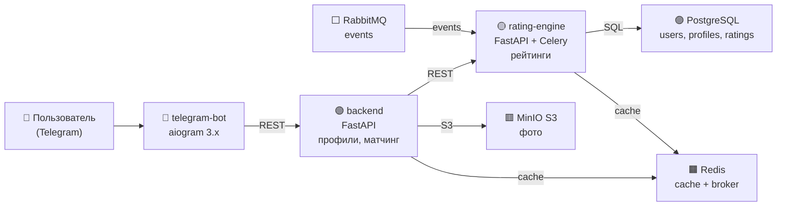

## Этап 1: Планирование и проектирование
### Что будет внутри

- Регистрация через /start  
- Анкета: имя, возраст, город, описание, фото  
- Показ случайных (или умных) анкет другим  
- Лайк / пропустить  
- Матч → уведомление обоим  
- Простая система популярности (кто чаще лайкают — показываем чаще)
### 1. Описание сервисов

Проект реализован в виде микросервисной архитектуры с минимальным количеством сервисов (4 микросервиса + инфраструктура), чтобы сохранить преимущества независимого масштабирования и при этом не усложнять разработку.

| Сервис            |  Технологии               | Основная функция                                     |
|-------------------|---------------------------|----------------------------------------------------------------|
| telegram-bot      | Python + aiogram 3.x      | Интерфейс пользователя, состояния (FSM), клавиатуры, обработка сообщений |
| backend           | FastAPI                   | Пользователи, профили, CRUD анкет, загрузка фото, базовый матчинг |
| rating-engine     | FastAPI + Celery          | Расчёт первичного, поведенческого и комбинированного рейтинга, периодические задачи |
| storage           | MinIO (S3-совместимый)    | Хранение и раздача фотографий пользователей                    |
###
[services.md](docs/services.md)

**Инфраструктурные компоненты:**
- PostgreSQL — основное хранилище данных
- Redis — кэш предзагруженных анкет + брокер Celery
- RabbitMQ — асинхронная передача событий (лайк, пасс, матч → пересчёт рейтинга)
- Celery Beat — периодический пересчёт рейтингов

### 2. Архитектура системы и схема дизайна


### Схема базы данных (PostgreSQL)

```mermaid
erDiagram
    USERS ||--o{ PROFILES : "has one"
    PROFILES ||--|| USER_RATINGS : "has exactly one"
    PROFILES ||--o{ LIKES : "receives"
    USERS ||--o{ LIKES : "gives"
    USERS ||--o{ MATCHES : "initiates as user1"
    USERS ||--o{ MATCHES : "receives as user2"
    PROFILES {
        bigint id PK
        bigint user_id FK
        text gender
        smallint age
        text city
        text bio
        text[] interests
        text[] photos
        int completeness "generated"
        timestamptz updated_at
    }
    USER_RATINGS {
        bigint profile_id PK,FK
        int primary_score
        int behavioral_score
        int combined_score "generated"
        timestamptz last_calculated_at
    }
    LIKES {
        bigint id PK
        bigint from_user_id FK
        bigint to_profile_id FK
        boolean is_like
        timestamptz created_at
    }
    MATCHES {
        bigint id PK
        bigint user1_id FK
        bigint user2_id FK
        timestamptz created_at
    }
    USERS {
        bigint id PK
        bigint telegram_id UK
        text username
        timestamptz created_at
        boolean is_active
    }
