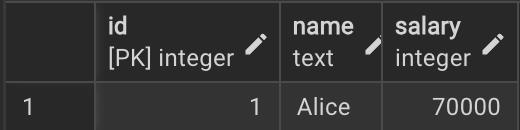
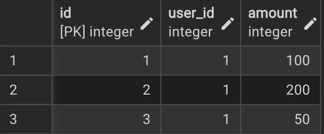
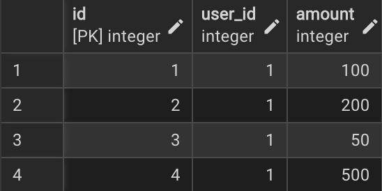
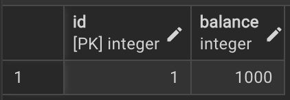
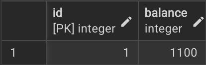

# Отчёт: Аномалии изоляции в SQL

## Подготовка окружения

### 1. Создать базу данных PostgreSQL

```bash
psql -U postgres -c "CREATE DATABASE isolation_demo;"
```


## 1. Dirty Read — грязное чтение

### Описание

TX2 читает строку, которую TX1 изменил, но ещё не зафиксировал (`COMMIT`).  
Если TX1 делает `ROLLBACK` — TX2 уже работал с данными, которых никогда не существовало.

### Таблица и данные

```sql
CREATE TABLE accounts (id INT PRIMARY KEY, balance INT);
INSERT INTO accounts VALUES (1, 1000);
```

### Шаги воспроизведения

| Время | TX1 | TX2 (READ UNCOMMITTED) |
|---|---|---|
| t1 | `UPDATE accounts SET balance = 9999` | |
| t2 | *(не зафиксировано)* | `SELECT balance` → **9999** ← грязное чтение |
| t3 | `ROLLBACK` | |
| t4 | | баланс 9999 никогда не существовал |

### Результат

PostgreSQL **предотвращает** dirty read даже на уровне `READ UNCOMMITTED` — он обрабатывается как `READ COMMITTED`. TX2 увидит значение `1000`.

```
Таблица accounts создана. Начальный баланс: 1000

[TX1] Старт транзакции
[TX1] Баланс изменён на 9999 — НЕ зафиксировано
[TX2] Старт транзакции (уровень: READ UNCOMMITTED)
[TX2] Прочитанный баланс: 1000
[TX2] ✓  Dirty Read не произошёл — PostgreSQL защищает даже на READ UNCOMMITTED
[TX1] ROLLBACK — изменения отменены

Итоговый баланс после обеих транзакций: 1000
```

### Как избежать

Использовать уровень изоляции **`READ COMMITTED`** и выше.  
В PostgreSQL dirty read невозможен на любом уровне изоляции.

---

## 2. Non-Repeatable Read — неповторяющееся чтение

### Описание

TX2 читает одну строку дважды в рамках одной транзакции — и получает разные значения, потому что TX1 изменил её между двумя чтениями.

### Таблица и данные

```sql
CREATE TABLE employees (id INT PRIMARY KEY, name TEXT, salary INT);
INSERT INTO employees VALUES (1, 'Alice', 50000);
```

### Шаги воспроизведения

| Время | TX1 | TX2 (READ COMMITTED) |
|---|---|---|
| t1 | | `SELECT salary` → **50000** |
| t2 | `UPDATE salary = 70000` | |
| t3 | `COMMIT` | |
| t4 | | `SELECT salary` → **70000** ← другое значение! |

### Результат


TX2 получает разные значения при двух одинаковых запросах внутри одной транзакции.

```
Таблица employees создана. Начальная зарплата Alice: 50000

[TX2] Старт транзакции (уровень: READ COMMITTED)
[TX2] Первое чтение зарплаты: 50000
[TX1] Старт — обновляем зарплату до 70000
[TX1] COMMIT — зарплата зафиксирована: 70000
[TX2] Второе чтение зарплаты: 70000
[TX2] NON-REPEATABLE READ: 50000 → 70000, данные изменились внутри транзакции!
```

### Как избежать

Использовать уровень изоляции **`REPEATABLE READ`** или **`SERIALIZABLE`**.  
На `REPEATABLE READ` TX2 будет видеть одно и то же значение в течение всей транзакции.

---

## 3. Phantom Read — фантомное чтение

### Описание

TX2 выполняет один и тот же `SELECT` с условием дважды — и получает разное количество строк, потому что TX1 вставил новую строку между запросами.

### Таблица и данные

```sql
CREATE TABLE orders (id SERIAL PRIMARY KEY, user_id INT, amount INT);
INSERT INTO orders (user_id, amount) VALUES (1, 100), (1, 200), (1, 50);
```

### Шаги воспроизведения

| Время | TX1 | TX2 (READ COMMITTED) |
|---|---|---|
| t1 | | `SELECT COUNT(*) WHERE user_id=1` → **3** |
| t2 | `INSERT INTO orders (user_id=1, amount=500)` | |
| t3 | `COMMIT` | |
| t4 | | `SELECT COUNT(*) WHERE user_id=1` → **4** ← фантомная строка! |

### Результат


TX2 при повторном запросе видит строку, которой не было при первом чтении.

```
Таблица orders создана. Заказов у user_id=1: 3

[TX2] Старт транзакции (уровень: READ COMMITTED)
[TX2] Первый COUNT заказов: 3
[TX1] Старт — добавляем новый заказ для user_id=1
[TX1] COMMIT — новый заказ добавлен
[TX2] Второй COUNT заказов: 4
[TX2] PHANTOM READ: 3 → 4, появились 'фантомные' строки!
```


### Как избежать

Использовать уровень изоляции **`SERIALIZABLE`**.  
PostgreSQL на уровне `REPEATABLE READ` также защищает от фантомных чтений.

---

## 4. Lost Update — потерянное обновление

### Описание

TX1 и TX2 оба читают значение, считают новое и записывают результат.  
Последний перезапишет результат первого — одно из обновлений будет потеряно.

### Таблица и данные

```sql
CREATE TABLE accounts (id INT PRIMARY KEY, balance INT);
INSERT INTO accounts VALUES (1, 1000);
```

### Шаги воспроизведения

| Время | TX1 (READ COMMITTED) | TX2 (READ COMMITTED) |
|---|---|---|
| t1 | `SELECT balance` → **1000** | |
| t2 | | `SELECT balance` → **1000** |
| t3 | | `UPDATE balance = 1000 + 200 = 1200`, `COMMIT` |
| t4 | `UPDATE balance = 1000 + 100 = 1100`, `COMMIT` | |
| t5 | Итог: **1100** ← должно быть **1300**! | |

### Результат



TX2 записал 1200, затем TX1 перезаписал 1100 — обновление TX2 (+200) потеряно.

```
Таблица accounts создана. Начальный баланс: 1000
Ожидаемый итог: TX1 +100, TX2 +200 → должно быть 1300

[TX1] Старт — читаем баланс
[TX1] Прочитан баланс: 1000
[TX2] Старт — читаем баланс
[TX2] Прочитан баланс: 1000
[TX2] COMMIT — записан баланс: 1200 (было 1000 + 200)
[TX1] COMMIT — записан баланс: 1100 (было 1000 + 100)

Итоговый баланс: 1100
LOST UPDATE: ожидалось 1300, получили 1100. Одно обновление потеряно!
```

### Как избежать

1. **Атомарный UPDATE** без чтения в приложении:
   ```sql
   UPDATE accounts SET balance = balance + 100 WHERE id = 1;
   ```
2. **`SELECT FOR UPDATE`** — явная блокировка строки:
   ```sql
   SELECT balance FROM accounts WHERE id = 1 FOR UPDATE;
   ```
3. **Оптимистичная блокировка** — поле `version` в таблице.
4. **Уровень изоляции `SERIALIZABLE`**.

---

## Сводная таблица уровней изоляции

| Уровень изоляции | Dirty Read | Non-Repeatable Read | Phantom Read | Lost Update |
|---|:---:|:---:|:---:|:---:|
| READ UNCOMMITTED | возможен| возможен | возможен | возможен |
| READ COMMITTED | ✓ | возможен | возможен | возможен |
| REPEATABLE READ | ✓ | ✓ | ✓² | возможен |
| SERIALIZABLE | ✓ | ✓ | ✓ | ✓ |

В PostgreSQL dirty read невозможен ни на одном уровне.  
PostgreSQL на REPEATABLE READ также защищает от phantom read.
